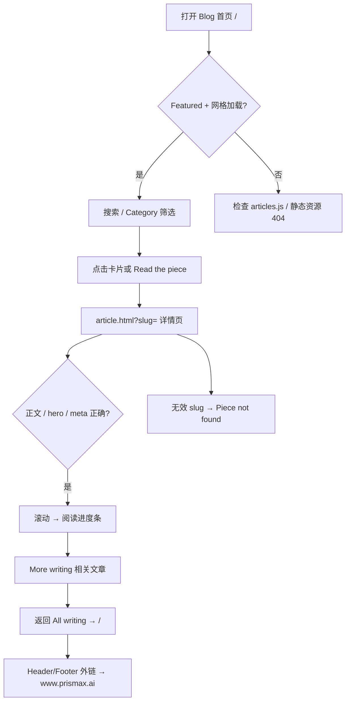
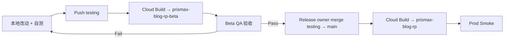

# PrismaX Blog（prismax-blog-rp）Repo 分析与 E2E 测试

> 分析日期：2026-08-27  
> 仓库：`PrismaXAI/prismax-blog-rp`  
> 本地路径：`/Users/wanxin/PycharmProjects/WORK/Prismax/prismax-blog-rp`  
> 数据来源：README、源码、Docker/nginx 配置；未执行远端部署验证。

---

## 1. Repo 是干什么的

`prismax-blog-rp` 是 **PrismaX 官网 Blog 的静态前端 handoff 包**，供 Marketing 团队维护内容展示，独立于主站 `www.prismax.ai` 部署。

| 维度 | 说明 |
| --- | --- |
| 类型 | 纯静态站点，无 build step、无 CMS、无后端 API |
| 页面 | Blog 列表页 + 文章详情页 |
| 数据 | 14 篇文章，内嵌在 `blog/articles.js` 的 `window.PRISMAX_ARTICLES` 数组 |
| 部署 | Docker + nginx → Google Cloud Run |
| 受众 | Marketing 写内容、QA 验 UI/导航、Release owner 从 `testing` 合并到 `main` |

**核心用户流程：**

```text
进入 Blog 首页（/）
  → 浏览 Featured + 卡片网格
  → 搜索 / 按 Category 筛选
  → 点击卡片进入文章（/article.html?slug=...）
  → 阅读正文 + Related posts
  → 返回列表（/）
```

Header / Footer 中的主导航链接指向 `https://www.prismax.ai/...`（绝对 URL），Blog 本身托管在独立 subdomain 上时，用户点击 Logo 或 Product 链接会跳回主站——这是设计行为，不是 bug。

---

## 2. 目录与架构

```text
prismax-blog-rp/
  blog/
    blog.html       列表页（Featured + 搜索 + Category + 卡片网格）
    article.html    详情页（?slug= 查文章，Related posts）
    blog.css        两页共用样式 + @font-face
    blog.js         共享 helper（card 渲染、筛选、scroll reveal、header）
    articles.js     14 篇文章 fixture（CMS pipeline 生成，本 repo 只读）
    media/covers/   封面图
  brand_assets/
    fonts/          Editorial New + Catalogue
    logos/          PrismaX logo
  Dockerfile        nginx:1.27-alpine，8080 端口
  nginx.conf        静态文件 + /healthz
  cloudbuild.yaml   Cloud Build → Artifact Registry → Cloud Run
```

### 2.1 数据流（无网络请求）

```text
articles.js 定义 window.PRISMAX_ARTICLES
       ↓
blog.html / article.html 通过 <script> 直接读取
       ↓
blog.js 提供 card / bySlug / fmtDate / filter / reveal 等 helper
       ↓
DOM 渲染（不 fetch、不 router）
```

### 2.2 生产路径映射（Docker/nginx）

nginx 将 `blog/` 内容复制到站点根目录，`blog.html` 同时作为 `index.html`：

| 本地开发路径 | Cloud Run 生产路径 |
| --- | --- |
| `blog/blog.html` | `/` |
| `blog/article.html?slug=...` | `/article.html?slug=...` |
| `blog/articles.js` | `/articles.js` |
| `brand_assets/...` | `/brand_assets/...` |
| `blog/media/covers/...` | `/media/covers/...` |

健康检查：`GET /healthz` → `200 ok`

### 2.3 Category 映射

| articles.js 值 | UI 显示 |
| --- | --- |
| `insight` | Insight |
| `announcement` | Announcement |
| `project-info` | Product |
| `feature-blog` | Feature |

### 2.4 当前文章 fixture（14 篇，newest-first）

| slug | category | 用途建议 |
| --- | --- | --- |
| `not-all-robotics-data-is-created-equal` | insight | Featured 默认 lead；含 video + 双图 |
| `introducing-the-prismax-regional-ambassador-program` | announcement | Category 筛选 |
| `prismax-product-updates-q1-2026` | project-info | Product 类 |
| `prismax-joins-nvidia-inception-program` | announcement | 短文章 |
| `the-service-layer-era` | project-info | 中等长度 |
| `intro-to-ai-for-robotics` | insight | 含 video pair |
| `teleoperation-now-future-ai-robotics` | insight | 外链较多 |
| `prismax-launches-ai-teleoperations-platform` | announcement | — |
| `prismax-base-layer-ai-robotics` | project-info | — |
| `prismax-raises-11m-a16z-robotics-funding` | feature-blog | 唯一 Feature 类 |
| `gr00t-part-4-advancing-robotics-foundation-models` | insight | 系列文章 |
| `gr00t-part-3-predictive-control-ai-robotics` | insight | 系列文章 |
| `gr00t-part-2-labels-without-labels` | insight | 系列文章 |
| `gr00t-part-1-foundation-models-history-ai-robotics` | insight | 系列文章 |

---

## 3. 部署与环境

| 环境 | Git 分支 | Cloud Run Service | 说明 |
| --- | --- | --- | --- |
| Production | `main` | `prismax-blog-rp` | Release owner 从 `testing` merge |
| Beta | `testing` | `prismax-blog-rp-beta` | Marketing push 后自动部署 |

Marketing 工作流：

1. 本地改完并自测
2. Push 到 `testing` → Beta 自动部署
3. QA 在 Beta 验 E2E
4. Release owner merge `testing` → `main` → Production

Custom domain 映射不在本 repo 管理；E2E 时向 Release owner 确认 Beta / Prod 的实际 URL（Cloud Run 默认域名或自定义 blog subdomain）。

---

## 4. 本地测试环境搭建

### 4.1 方式 A：静态 HTTP Server（推荐，路径与生产一致）

```bash
cd /Users/wanxin/PycharmProjects/WORK/Prismax/prismax-blog-rp
python3 -m http.server 8000
```

打开：`http://localhost:8000/blog/blog.html`

> 注意：直接 `file://` 打开 `blog.html` 也能跑基本流程，但部分路径（如 article 页 `href="/"`）在 file 协议下行为与生产不一致，**E2E 请用 HTTP server**。

### 4.2 方式 B：Docker（与 Cloud Run 一致）

```bash
cd /Users/wanxin/PycharmProjects/WORK/Prismax/prismax-blog-rp
docker build -t prismax-blog-rp:local .
docker run --rm -p 8080:8080 prismax-blog-rp:local
```

打开：`http://localhost:8080/`（根路径即列表页）

健康检查：

```bash
curl -s http://localhost:8080/healthz
# 预期: ok
```

### 4.3 浏览器建议

- Desktop：Chrome / Safari / Firefox 最新版
- Mobile：iOS Safari、Android Chrome（viewport + 触控）
- 可选：`prefers-reduced-motion: reduce` 下验证动画降级

---

## 5. E2E Flow 概览



---

## 6. 测试分析

### 6.1 测试层级

| 层级 | 目标 | 工具 |
| --- | --- | --- |
| 本地 Smoke | 改 UI/CSS/JS 后快速回归 | HTTP server 或 Docker + 手工 |
| Beta E2E | Marketing push 后完整验 flow | Beta URL + 多浏览器 |
| Prod Smoke | merge 到 main 后确认线上 | Prod URL + 核心路径 |
| 非功能 | 性能、SEO meta、无障碍、CSP | Lighthouse / 手工 |

本 repo **无自动化测试脚本**；E2E 以手工 checklist 为主。若后续要加 Playwright，建议以 Docker 8080 或 Beta URL 为 baseURL。

### 6.2 主要风险

| ID | 级别 | 风险描述 | 验证方式 |
| --- | --- | --- | --- |
| R01 | P0 | `articles.js` 未加载或语法错误 → 整站空白 | 控制台无报错；网格有 14 张卡（首篇在 Featured 隐藏对应卡） |
| R02 | P0 | slug 拼写错误 → 404 内容 | 访问无效 slug 显示 "Piece not found." |
| R03 | P0 | 封面 / 字体 / logo 静态资源 404 | Network 面板无红色 404 |
| R04 | P1 | Featured 与网格重复显示同一篇文章 | 当前 lead 的 card 带 `is-hidden` |
| R05 | P1 | Category 筛选后 Featured 未跟随更新 | 筛 `announcement` 时 Featured 变为该类最新一篇 |
| R06 | P1 | 搜索无结果时 empty 态 | 输入 `zzzznotexist` → "No writing matches your search." |
| R07 | P1 | 文章页 video 在 reduced-motion 下应有 controls | 系统开 reduce motion 验详情页 |
| R08 | P1 | Header `href="/"` 在 nginx 根路径下正确回列表 | Docker 8080 环境验 article → All writing |
| R09 | P2 | 外链仍指向生产主站 | 点击 Logo 跳转 `www.prismax.ai` |
| R10 | P2 | CSP 阻止 inline script | 生产环境控制台无 CSP violation（nginx 已配 `unsafe-inline`） |
| R11 | P0 | Marketing 误 push `main`，未测改动直上 Prod | 流程禁止；合并前确认分支与 Beta 已验收 |
| R12 | P0 | Beta 未部署成功 / 未验完就请求 merge | Cloud Build 成功 + Beta Smoke 通过后再找 Release owner |
| R13 | P0 | Prod 合并未用 `testing` 或用了 `--force` | 按 README `merge --no-ff origin/testing` 验收 |
| R14 | P1 | Beta/Prod 镜像 tag 互相覆盖 | 确认 image tag 为各自 Cloud Build ID |
| R15 | P1 | Beta 已更新但 Prod 误显示旧内容（或反之） | 对比两环境同源改动；Prod 仅在 merge 后变化 |

### 6.3 不在本 repo 范围内的项

- CMS / markdown → `articles.js` 生成 pipeline（只验输出结果，不验 pipeline 本身）
- Custom domain / DNS / SSL
- 主站 `www.prismax.ai` 导航是否与 Blog footer 一致（需跨 repo 验）
- Marketing 是否有 GCP 控制台权限（设计上不需要）

---

## 7. Marketing 发布流程测试用例

> 对应 README **Marketing workflow**：  
> ① Make and test changes locally → ② Push to `testing` to deploy Beta → ③ Ask release owner to merge into `main`。



| 环境 | 分支 | Cloud Run | 谁操作 |
| --- | --- | --- | --- |
| Local | 任意工作分支 | 无（http.server / Docker） | Marketing |
| Beta | `testing` | `prismax-blog-rp-beta` | Marketing push；QA 验收 |
| Production | `main` | `prismax-blog-rp` | **仅** Release owner merge + push |

进度：`notstart` | `inprogress` | `pendingfix` | `done`  
合计：**18** 条（本地 6 / Beta 7 / Prod 晋升 5）

| ID | 阶段 | 优先级 | 场景 | 前置条件 | 操作步骤 | 预期结果 | 进度 |
| --- | --- | --- | --- | --- | --- | --- | --- |
| MW-001 | 本地 | P0 | 在正确分支上改动 | 有 repo Write 权限 | `git fetch`；确认当前不直接在 `main` 上改；基于最新 `testing` 开改 | 工作基于 `testing`（或从 `testing` 拉出的 topic 分支）；未在 `main` 上直接 commit | notstart |
| MW-002 | 本地 | P0 | 本地 HTTP / Docker 启动成功 | 改动已保存 | `python3 -m http.server 8000` 或 `docker build && docker run -p 8080:8080` | 页面可打开；`/healthz`（Docker）返回 `ok` | notstart |
| MW-003 | 本地 | P0 | 本次改动在本地可见且正确 | 已知改动点（文案 / CSS / 新 slug / 封面等） | 打开列表 + 相关详情页；对照改动说明逐项检查 | 改动按预期呈现；无关页面无回归（至少首页 + 1 篇详情） | notstart |
| MW-004 | 本地 | P0 | 核心 E2E Smoke（本地） | Docker 8080 或 localhost:8000/`blog/` | 跑 BLOG-001 / 013 / 015 / 016（或本文 §9 浏览器最小路径） | P0 Smoke 通过；控制台无 JS 错误；关键静态资源无 404 | notstart |
| MW-005 | 本地 | P1 | 内容改动未手改只读约束外的文件 | 若改的是文章内容 | 确认 `articles.js` 来源符合 handoff 约定；封面路径、slug 唯一、category 合法 | slug 无冲突；category 为 insight/announcement/project-info/feature-blog 之一；封面路径可加载 | notstart |
| MW-006 | 本地 | P1 | Push 前 diff / commit 自检 | 本地自测已通过 | `git status` / `git diff`；确认无误提交密钥、无无关大文件；commit message 说明改动 | 仅含预期文件；可清晰描述「测了什么、改了什么」以便 Release owner 审 | notstart |
| MW-007 | Beta | P0 | 只 push 到 `testing`，不 push `main` | 本地自测通过 | `git push origin <branch>:testing`（或在 `testing` 上 push）；**不**执行 `git push origin main` | 远程 `testing` 更新；`main` 未因本次 Marketing 操作变动 | notstart |
| MW-008 | Beta | P0 | Cloud Build（Beta）成功 | 已 push `testing` | 在 GCP Cloud Build / GitHub 部署状态中查看对应 build | Build SUCCESS；镜像 tag 为本次 `BUILD_ID`；部署目标为 `prismax-blog-rp-beta` | notstart |
| MW-009 | Beta | P0 | Beta 站点上线且健康 | Build SUCCESS | `curl <beta>/healthz`；浏览器打开 Beta `/` | `healthz` → `ok`；首页可加载；控制台无致命错误 | notstart |
| MW-010 | Beta | P0 | Beta 展示与本地改动一致 | 记录本地改动点 | 在 Beta 核对同一改动点（标题/样式/新文章/封面） | Beta 与本地验收结果一致；无「本地有、Beta 无」 | notstart |
| MW-011 | Beta | P0 | Beta 核心 E2E 通过 | Beta URL 可用 | 执行 BLOG-001、007、013、015、016、018（或全量 P0） | 全部 Pass；失败则 **不** 请求 merge | notstart |
| MW-012 | Beta | P1 | Push testing 后 Prod 未被误更新 | 记下 Prod 改动前指纹（如 Featured 标题 / 某 CSS 特征） | Beta 部署完成后立即打开 Prod `/` | Prod 仍为旧版本；仅 Beta 出现新改动 | notstart |
| MW-013 | Beta | P1 | 请求 merge 前的交接清单 | Beta QA Pass | Marketing 向 Release owner 提供：commit / PR 或 testing tip SHA、改动摘要、Beta URL、本地+Beta 测试结果 | Release owner 无需猜测；信息足够执行 README 中的 promotion 命令 | notstart |
| MW-014 | Prod | P0 | Release owner 按标准流程晋升 | Beta 已验收；Release owner 操作 | 按 README：`git switch main` → `pull` → `fetch` → `merge --no-ff origin/testing` → `push origin main`；**不用** `--force` | Merge commit 存在；`main` 包含 `testing` 上已测提交；无 force-push 历史 | notstart |
| MW-015 | Prod | P0 | Cloud Build（Prod）成功并指向正确服务 | `main` 已 push | 查看 Prod 对应 Cloud Build | Build SUCCESS；部署到 `prismax-blog-rp`（非 beta）；镜像 tag 为本次 Prod `BUILD_ID`（与 Beta 不同） | notstart |
| MW-016 | Prod | P0 | Prod Smoke：改动已上线 | Prod Build SUCCESS | 打开 Prod `/` + 改动相关详情；`curl <prod>/healthz` | 改动与 Beta 验收一致；`healthz` → `ok`；BLOG-001/013/015 通过 | notstart |
| MW-017 | Prod | P1 | Beta / Prod 内容对齐 | 同一次 release 完成后 | 对比 Beta 与 Prod 的关键页面（改动点 + 文章计数） | 两边展示一致（除非另有未晋升改动仍在 testing） | notstart |
| MW-018 | Prod | P1 | 禁止 Marketing 直推 main（流程合规） | Marketing 账号有 Write | 确认团队约定：Marketing 不向 `main` push；抽查近期 `main` 的 push 作者是否为 Release owner | `main` 更新来自 Release owner 的 merge；无 Marketing 直推绕过 Beta | notstart |

### 7.1 按改动类型的最小验收范围（本地 + Beta 共用）

| 改动类型 | 本地 / Beta 至少验 |
| --- | --- |
| 文案 / 新文章 / `articles.js` | Featured、计数、新 slug 详情、搜索能搜到、无效 slug 仍正常 |
| CSS / 布局 / 字体 | 列表 + 详情桌面与 375px；logo/字体无 404 |
| `blog.js` / 筛选逻辑 | Category、搜索、无结果 empty、Featured 跟随筛选 |
| Header / Footer / 外链 | Logo、主导航、Footer Blog、社交链接 |
| Docker / nginx / Cloud Build | `/`、`/article.html?slug=...`、`/healthz`、响应头 |

---

## 8. 产品功能 E2E 测试用例

进度：`notstart` | `inprogress` | `pendingfix` | `done`  
合计：**36** 条（列表页 6 / 搜索筛选 6 / 导航 5 / 详情页 7 / 外链 5 / 部署 4 / 响应式 3）  
> 部署类 BLOG-030~033 可与 §7 MW 用例一并执行；产品回归以本表为准。

| ID | 模块 | 优先级 | 场景 | 前置条件 | 操作步骤 | 预期结果 | 进度 |
| --- | --- | --- | --- | --- | --- | --- | --- |
| BLOG-001 | 列表页 | P0 | 首页正常加载 | 本地 Docker 8080 或 Beta URL | 打开 `/` | 标题 "PrismaX blog"；Featured 区可见；网格有文章卡片；`All writing` 旁显示 `14 pieces` | notstart |
| BLOG-002 | 列表页 | P0 | Featured 展示最新文章 | 同上 | 查看 Featured 区 | 展示 `not-all-robotics-data-is-created-equal`；含封面、标题、描述、日期、阅读时长、Read the piece 按钮 | notstart |
| BLOG-003 | 列表页 | P0 | 网格卡片信息完整 | 同上 | 抽查 3 张卡片 | 每张含封面图、标题、摘要、Category 标签、日期、Read → | notstart |
| BLOG-004 | 列表页 | P1 | 静态资源加载 | 同上 | DevTools Network 刷新 | `articles.js`、`blog.js`、`blog.css`、logo、封面均 200；控制台无 JS 错误 | notstart |
| BLOG-005 | 列表页 | P1 | Featured 文章不在网格重复 | 同上 | 对比 Featured 标题与可见网格 | Featured 对应 slug 的 card 不可见（`is-hidden`） | notstart |
| BLOG-006 | 列表页 | P1 | Scroll reveal 动画 | 未开 reduced-motion | 慢速滚动页面 | Featured / 卡片渐入；Controls 区（搜索、下拉）不应 fade-in 延迟出现 | notstart |
| BLOG-007 | 搜索筛选 | P0 | Category 筛选 | 列表页已加载 | Category 选 `Announcement` | 仅 announcement 类文章可见；计数更新；Featured 变为该类最新一篇（如 `introducing-the-prismax-regional-ambassador-program`） | notstart |
| BLOG-008 | 搜索筛选 | P0 | 搜索标题关键词 | 列表页已加载 | 搜索框输入 `Gr00t` | 显示 Gr00t 系列 4 篇；计数 `4 pieces`；Featured 为匹配结果中最新的 | notstart |
| BLOG-009 | 搜索筛选 | P0 | 搜索无结果 | 列表页已加载 | 输入 `zzzznotexist` | 显示 "No writing matches your search."；Featured 隐藏；网格 empty | notstart |
| BLOG-010 | 搜索筛选 | P1 | 搜索 + Category 组合 | 列表页已加载 | Category=`Insight`，搜索 `foundation` | 结果为两条件交集；计数与可见卡片一致 | notstart |
| BLOG-011 | 搜索筛选 | P1 | 清空搜索恢复 | 曾筛选至无结果 | 清空搜索框，Category 改回 All | 恢复 14 pieces；Featured 回到最新一篇 | notstart |
| BLOG-012 | 搜索筛选 | P1 | 筛选后卡片立即可见 | 列表页已加载 | 切换 Category 或输入搜索 | 匹配卡片立即显示（非 scroll 后才 fade-in）；`fromUser` 路径不应 opacity 0 卡住 | notstart |
| BLOG-013 | 导航 | P0 | 点击网格卡片进入详情 | 列表页已加载 | 点击任意卡片 | URL 变为 `/article.html?slug=<slug>`；页面展示对应标题与正文 | notstart |
| BLOG-014 | 导航 | P0 | Featured Read the piece | 列表页已加载 | 点击 Featured 的标题或按钮 | 进入 Featured 文章详情 | notstart |
| BLOG-015 | 导航 | P0 | 直接 URL 打开详情 | 已知 slug | 访问 `/article.html?slug=intro-to-ai-for-robotics` | 正确渲染该文；`document.title` 含文章标题 | notstart |
| BLOG-016 | 导航 | P0 | 无效 slug | — | 访问 `/article.html?slug=does-not-exist` | 显示 "Piece not found."；有返回 All writing 链接 | notstart |
| BLOG-017 | 导航 | P1 | 浏览器前进/后退 | 从列表进入详情 | 浏览器 Back | 回到列表页，筛选状态是否保留取决于浏览器 bfcache（记录实际行为） | notstart |
| BLOG-018 | 详情页 | P0 | 文章 meta 与 hero | slug=`not-all-robotics-data-is-created-equal` | 打开详情页 | Category=Insight；日期格式如 `May 14, 2026`；阅读时长；hero 封面显示 | notstart |
| BLOG-019 | 详情页 | P0 | 正文 HTML 渲染 | 含 video 的文章 | 打开 `intro-to-ai-for-robotics` | 正文段落、标题、图片正常；video 自动静音循环（非 reduced-motion） | notstart |
| BLOG-020 | 详情页 | P1 | 相邻双图 figpair | 含 `<p></p>` 的文章 | 打开 `not-all-robotics-data-is-created-equal` 滚动到双图 | 两图并排于 `.prose-figpair` 容器 | notstart |
| BLOG-021 | 详情页 | P1 | 阅读进度条 | 长文章；未 reduce-motion | 向下滚动 | 顶部 `#progress` 宽度随阅读进度增加 | notstart |
| BLOG-022 | 详情页 | P1 | More writing 相关推荐 | 任意详情页 | 滚动至底部 | 最多 3 张相关卡片；同 category 优先；点击可进入另一篇 | notstart |
| BLOG-023 | 详情页 | P1 | 返回列表 | 详情页 | 点击 "← All writing" 或 More writing 区 "All writing" | 回到 `/` 列表页 | notstart |
| BLOG-024 | 详情页 | P2 | Reduced motion 降级 | OS 开启 reduce motion | 打开含 video 的详情页 | video 显示 controls；不 autoplay；reveal 直接可见 | notstart |
| BLOG-025 | 外链 | P1 | Header Logo 回主站 | 任意页 | 点击 Logo | 跳转 `https://www.prismax.ai/` | notstart |
| BLOG-026 | 外链 | P1 | Header 主导航 | 任意页 | 点击 Robotics Data / VLA Foundry / Plans / Research | 跳转对应 `www.prismax.ai` URL | notstart |
| BLOG-027 | 外链 | P1 | Footer Blog 链接 | 任意页 | 点击 Resources → Blog | 停留或回到 Blog 根路径（`/`） | notstart |
| BLOG-028 | 外链 | P2 | Footer 社交链接 | 任意页 | 点击 X / Discord / LinkedIn | 新 tab 打开正确 URL | notstart |
| BLOG-029 | 外链 | P2 | 正文内外链 | 含 `<a href>` 的文章 | 点击文内链接 | 外链正常打开；不破坏当前页 | notstart |
| BLOG-030 | 部署 | P0 | Beta 部署 Smoke | `testing` 分支已 push | 打开 Beta URL `/` | 与本地 Docker 行为一致；BLOG-001/013/015 通过 | notstart |
| BLOG-031 | 部署 | P0 | Production Smoke | `main` 已 merge 部署 | 打开 Prod URL `/` | 同上 | notstart |
| BLOG-032 | 部署 | P1 | Health check | Cloud Run 环境 | `curl <base>/healthz` | HTTP 200，body `ok` | notstart |
| BLOG-033 | 部署 | P1 | 安全响应头 | Cloud Run 环境 | 检查 Response Headers | 含 `X-Content-Type-Options`、`X-Frame-Options`、`Content-Security-Policy` 等（见 nginx.conf） | notstart |
| BLOG-034 | 响应式 | P1 | 移动端布局 | 375px 宽 viewport | 浏览列表 + 详情 | 无横向溢出；Header/nav 可用；卡片单列或合理换行 | notstart |
| BLOG-035 | 响应式 | P2 | 键盘导航 | Desktop | Tab 遍历搜索、下拉、卡片 | 焦点可见；卡片可 Enter 激活 | notstart |
| BLOG-036 | 响应式 | P2 | SEO meta | 详情页 | 查看 `<title>` 和 `meta description` | title=`{文章标题} — PrismaX Writing`；description 与文章 description 一致 | notstart |

---

## 9. 建议执行顺序

**按 Marketing workflow 主路径：**

1. **本地（MW-001 ~ 006）** — 分支正确、改动可见、本地 Smoke（含 BLOG P0）。
2. **Push `testing` → Beta（MW-007 ~ 013）** — Build 成功、Beta 与本地一致、Prod 未误更新；Pass 后再交接。
3. **Release owner → `main`（MW-014 ~ 018）** — 标准 merge、Prod Build、Prod Smoke、Beta/Prod 对齐。

**产品功能回归（穿插在本地 / Beta）：**

4. 列表 + 搜索筛选（BLOG-001 ~ 012）
5. 详情页富内容（BLOG-018 ~ 023）
6. 有余力再跑外链 / 响应式 P1–P2（BLOG-024 ~ 036）

---

## 10. 快速 Smoke 脚本（手工 + curl）

本地 Docker 启动后，可用以下命令做最小自动化辅助：

```bash
# 健康检查
curl -sf http://localhost:8080/healthz | grep -q ok && echo "healthz OK"

# 首页 HTML 含 masthead
curl -sf http://localhost:8080/ | grep -q "PrismaX blog" && echo "index OK"

# articles.js 可加载且含 14 篇
curl -sf http://localhost:8080/articles.js | grep -c '"slug":' | xargs -I{} test {} -eq 14 && echo "articles OK"

# 详情页 shell 可访问
curl -sf "http://localhost:8080/article.html?slug=intro-to-ai-for-robotics" | grep -q 'id="content"' && echo "article shell OK"
```

Beta / Prod 将 `localhost:8080` 换成对应 base URL 即可复用。

浏览器侧最小路径（约 3 分钟，本地与 Beta 各跑一次）：

1. 打开 `/` → 确认 Featured + 文章计数  
2. 搜索 `Gr00t` → 点进一篇详情  
3. 滚动 → More writing → Back to All writing  
4. 核对**本次改动点**是否出现

---

## 11. 已知限制（测时不必报 bug）

| 项 | 说明 |
| --- | --- |
| `articles.js` 只读 | 内容由 CMS pipeline 生成；Marketing 不应手改 posts |
| `EditorialNew-Italic.otf` 缺失 | 浏览器合成 italic，与线上一致 |
| Header/Footer 绝对 URL | Blog 独立域名时跳主站是预期行为 |
| 无 SSR / 无动态 OG | 社交分享 crawler 可能拿不到 per-article OG（若产品后续要求再单独立项） |
| GitHub Free 无法限制 main push | 靠团队流程禁止 Marketing 直推 main（见 MW-018） |

---

## 12. 相关文件索引

| 文件 | 作用 |
| --- | --- |
| `prismax-blog-rp/README.md` | Marketing handoff 说明、部署流程 |
| `prismax-blog-rp/blog/blog.html` | 列表页逻辑（Featured、filter、grid） |
| `prismax-blog-rp/blog/article.html` | 详情页逻辑（slug 查找、enhanceContent、More writing） |
| `prismax-blog-rp/blog/blog.js` | 共享 helper |
| `prismax-blog-rp/blog/articles.js` | 14 篇文章 fixture |
| `prismax-blog-rp/nginx.conf` | 生产静态服务 + CSP + healthz |
| `prismax-blog-rp/cloudbuild.yaml` | Beta/Prod Cloud Run 部署 |
